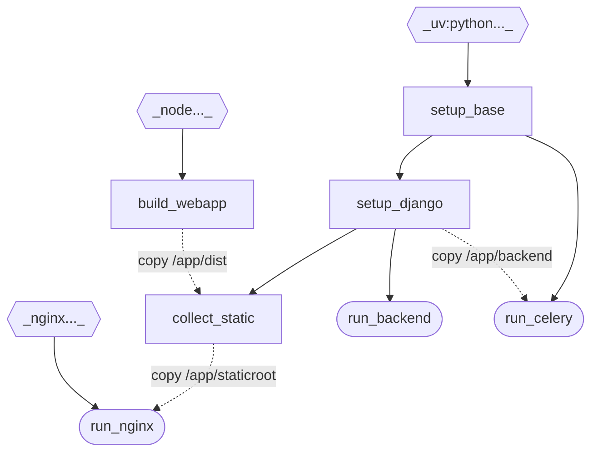

# Docker configuration
## Dockerfile overview
The Dockerfile defines 3 final and some intermediate targets.
The final targets are `run_nginx`, `run_backend` and `run_celery`.
All build targets are described in comments in the Dockerfile itself.
The graph below visualizes the build-time layer dependencies.

## Targets in Dockerfile
- A solid line from `a` to `b` represents the `FROM a AS b` instruction.
- A dashed line from `a` to `b` represents `COPY --from a` as a layer of target `b`. 

