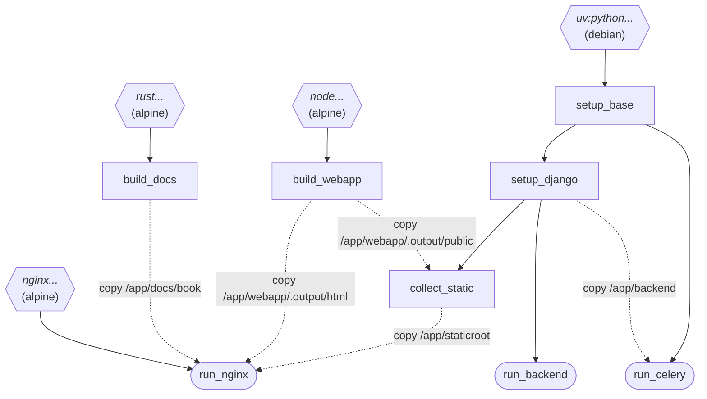
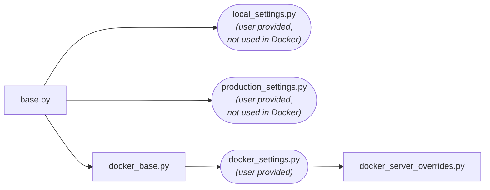

# Docker configuration
## Dockerfile overview
The Dockerfile defines three final and some intermediate targets.
The final targets are `run_nginx`, `run_backend` and `run_celery`.
All build targets are described in comments in the Dockerfile itself.
The graph below visualizes the build-time layer dependencies.

The images are based on Alpine Linux or on Debian. The variables `DEBIAN_VER` and `ALPINE_VER`
are used to select versions of the base images. The same versions should albo be used
when specifying image versions in `docker-compose.yml`. Using common versions let's
Docker reduce the disk space used by the images.

## Targets in Dockerfile
- A solid line from `a` to `b` represents the `FROM a AS b` instruction.
- A dashed line from `a` to `b` represents `COPY --from a` as a layer of target `b`. 

## Django setting modules used by each target
The Django setting files used by Docker are split into several layers to allow the server admins to customize some of
the settings. All the settings are part of the `backend/gutenberg/settings` module.

The `base.py`, `docker_base.py` and `docker_server_overrides.py` are all included in the repository
and should not be changed by the admins.

The `docker_settings.py` file is not stored in the GitHub repo, it should copied by the admin from
the `docker_settings.py.example` file and customized.
`docker_settings.py` is ignored in `.dockerignore` and is not used in any build steps in the `Dockerfile`.
It should be mounted by the admin at `/etc/gutenberg/docker_settings.py` and it is symlinked to be accessible
from `/app/backend/gutenberg/settings/docker_settings.py`.

> [!WARNING]
> The provided `docker_settings.py` file should start with the `from .docker_base import *` line. 

Build-time steps (like running the `collectstatic` command) use `docker_base.py` as the settings module.
Run-time commands (starting the Django server and Celery worker) use `docker_server_overrides.py`.
See the `ENV DJANGO_SETTINGS_MODULE=` commands in the `Dockerfile`.
